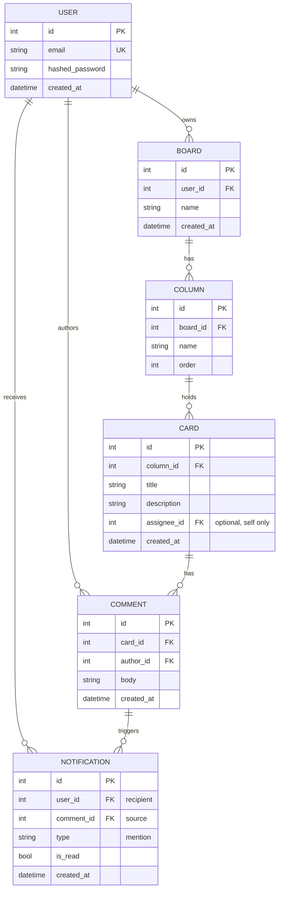

# Architecture — Kanban with Comments & @Mentions

FastAPI + SQLModel on SQLite, JWT auth. Single-user scope: every row is owned by one
user, and all access is filtered by `user.id`. Extends the existing starter (`User`,
`Task`) with five new models.

---

## 1. Data model

Ownership is transitive: Card belongs to Column belongs to Board belongs to User.
Authorization checks walk that chain and return **404 (not 403)** when a row isn't the
caller's — matching the starter's existing convention so we never leak existence.

---

## 2. API endpoints

| Method | Path | Purpose | Auth |
|---|---|---|---|
| POST | `/auth/register` | Create account | none |
| POST | `/auth/login` | Get JWT | none |
| GET | `/boards` | List my boards | JWT |
| POST | `/boards` | Create board (seeds Todo/Doing/Done) | JWT |
| PATCH | `/boards/{id}` | Rename board | JWT (owner) |
| DELETE | `/boards/{id}` | Delete board | JWT (owner) |
| GET | `/boards/{id}` | Board with columns + cards | JWT (owner) |
| POST | `/boards/{id}/columns` | Add column | JWT (owner) |
| PATCH | `/columns/{id}` | Rename / reorder column | JWT (owner) |
| DELETE | `/columns/{id}` | Delete column | JWT (owner) |
| POST | `/columns/{id}/cards` | Create card in column | JWT (owner) |
| PATCH | `/cards/{id}` | Edit card / move column (set column_id) | JWT (owner) |
| DELETE | `/cards/{id}` | Delete card | JWT (owner) |
| GET | `/cards/{id}/comments` | List card comments | JWT (owner) |
| POST | `/cards/{id}/comments` | Post comment (parses @mentions) | JWT (owner) |
| GET | `/notifications` | My notifications, unread first | JWT |
| GET | `/notifications/unread_count` | Count for nav badge | JWT |
| PATCH | `/notifications/{id}` | Mark read (on click) | JWT (owner) |
| GET | `/users/{username}` | Mention target profile (placeholder ok) | JWT |

---

## 3. State-flow narrative: comment → mention → notification → unread feed

1. **Comment posted.** Client POSTs body to `/cards/{id}/comments`. The route verifies
   the caller owns the card (via the Column→Board→User chain), then persists the
   `Comment` row first — the comment must exist before anything references it.
2. **Mention parsed.** With the comment saved, the mention parser runs on `body`:
   a regex extracts `@username` tokens, then a DB lookup keeps only tokens that match a
   real user. Unknown tokens and duplicates are dropped. (Pure function, unit-tested.)
3. **Notification created.** For each distinct, valid mentioned user, the API inserts a
   `Notification` row (`type="mention"`, `is_read=false`, `comment_id` = the new comment).
   Beginner track: mentioning yourself still creates a notification.
4. **Feed shows unread.** The recipient's next page load hits `/notifications/unread_count`
   for the nav badge; `/notifications` lists unread first, reverse-chronological. Clicking
   an item PATCHes it to `is_read=true` and navigates to the source card, decrementing the
   badge.

---

## 4. Tradeoffs considered

**A. Where does mention parsing live — model, route, or a service function?**
Chose a standalone pure function (`parse_mentions(body, session)`) called by the comment
route. It could have lived inline in the route handler, but pulling it out makes it
trivially unit-testable in isolation (no HTTP, no auth setup) — which matters because it's
a required TDD target with many edge cases. Cost: one extra module. Worth it.

**B. Notification `is_read` boolean vs a separate `read_at` timestamp.**
Chose a `bool is_read` plus `created_at`. A `read_at` timestamp would carry more info
(when it was read) and let `is_read` be derived, but the spec only needs unread-first
ordering and a click-to-read toggle. The boolean keeps the query (`WHERE is_read = false`)
and the unread count dead simple. If read-time analytics were ever needed, migrate then.

**Also considered:** storing a denormalized `mentions` list on the comment vs deriving
notifications directly. Rejected denormalization — notifications ARE the source of truth
for the feed, so a second copy would just risk drift.
